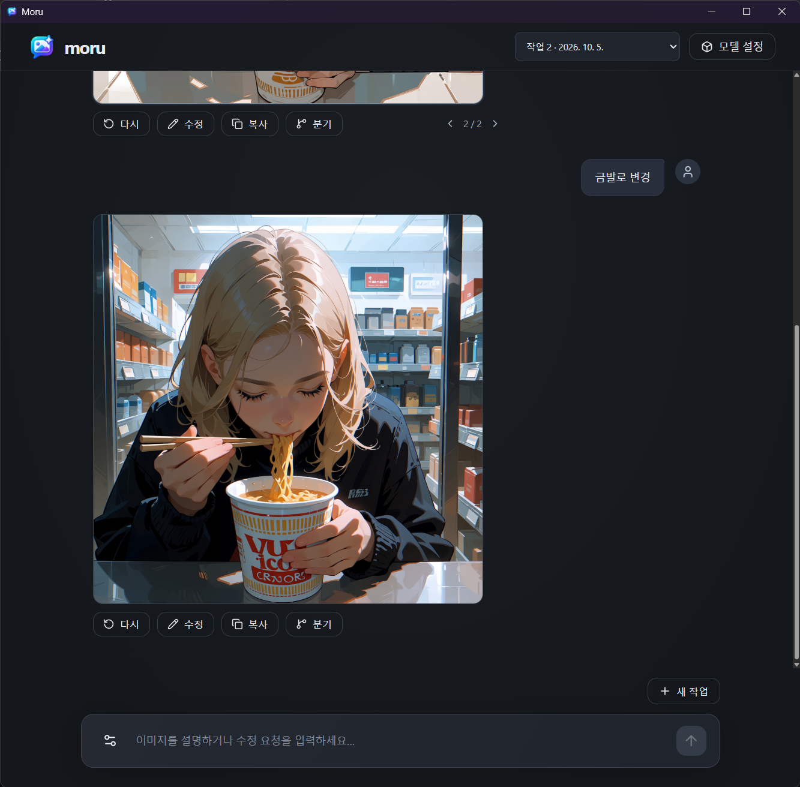

# Moru

[English](README.md) | [한국어](README.ko.md)

**말로 그리고, 대화로 다듬는 로컬 이미지 생성 앱.**



Moru는 원하는 장면을 자연어로 설명하면 이미지를 만드는 Windows 데스크톱 앱입니다.
프롬프트를 직접 작성할 필요 없이, 로컬 LLM이 요청을 이미지 생성용 프롬프트로 바꾸고
로컬 이미지 모델이 결과를 그립니다. 모델을 준비한 뒤에는 오프라인으로 사용할 수 있으며,
요청과 이미지를 외부 API로 보내지 않습니다.

## 대화로 이미지 만들기

“비 오는 밤, 편의점 앞에서 컵라면을 먹는 은발 소녀”처럼 장면을 설명하세요.
결과를 보며 “우산을 추가해 줘”, “표정만 무표정하게 바꿔 줘”라고 이어서 수정할 수 있습니다.
현재 이미지의 프롬프트와 최근 요청을 참고해 변경 사항을 반영합니다.

같은 요청으로 여러 결과를 만들어 비교하거나, 과거 이미지에서 대화를 분기해 다른 방향으로
이어갈 수 있습니다. 요청과 이미지 버전, 생성 설정은 로컬에 저장되어 나중에 다시 열 수 있습니다.

필요하면 실제 프롬프트를 직접 편집하고, 이미지 생성과 프롬프트 LLM의 설정을 조절할 수 있습니다.

Anima Turbo는 빠르게 시도하기에, Anima Aesthetic은 충분한 단계를 거쳐 생성하기에 적합합니다.
모델을 바꾸면 해당 모델의 권장 Steps와 CFG를 적용하며, 원하는 값으로 조절할 수 있습니다.

## 시작하기

Windows에서 NVIDIA GPU와 드라이버, Windows WebView2 Runtime이 필요합니다.
Git, Python 3.12, uv, Node.js 22.12 이상을 준비한 뒤 PowerShell에서 다음 명령을 실행하세요.
처음 준비할 때는 의존성과 ComfyUI를 다운로드하므로 인터넷 연결이 필요합니다.

```powershell
git clone https://github.com/neuwcodebox/moru.git
cd moru
uv sync --frozen --extra inference
uv run --extra inference python scripts/setup_comfyui.py
cd frontend
npm.cmd ci
npm.cmd run build
cd ..
uv run --extra inference python -m moru
```

앱이 열리면 **모델 설정**에서 필요한 모델을 다운로드하거나 이미 받은 파일을 선택하고,
입력창에 원하는 장면을 설명하세요. 모델은 저장소에 포함되어 있지 않으며,
사용 조건은 각 배포자의 라이선스를 따릅니다.

다음부터는 저장소 폴더에서 아래 명령으로 실행하면 됩니다.

```powershell
uv run --extra inference python -m moru
```

모델과 작업 기록은 저장소 폴더의 `models/`, `data/`에 보관합니다.
저장소 폴더를 통째로 옮기면 작업 기록과 폴더 안에 저장한 모델도 함께 옮길 수 있습니다.

## 개발

Python 코어와 React UI로 구성됩니다. Python 환경은 `uv`로 관리합니다.
개발 환경 준비, 실행, 테스트와 portable 빌드는 [기술 문서](docs/TECH.md#개발-및-검증)를 참고하세요.
앱의 동작과 요구사항은 [SPEC.md](docs/SPEC.md)에 정리되어 있습니다.
