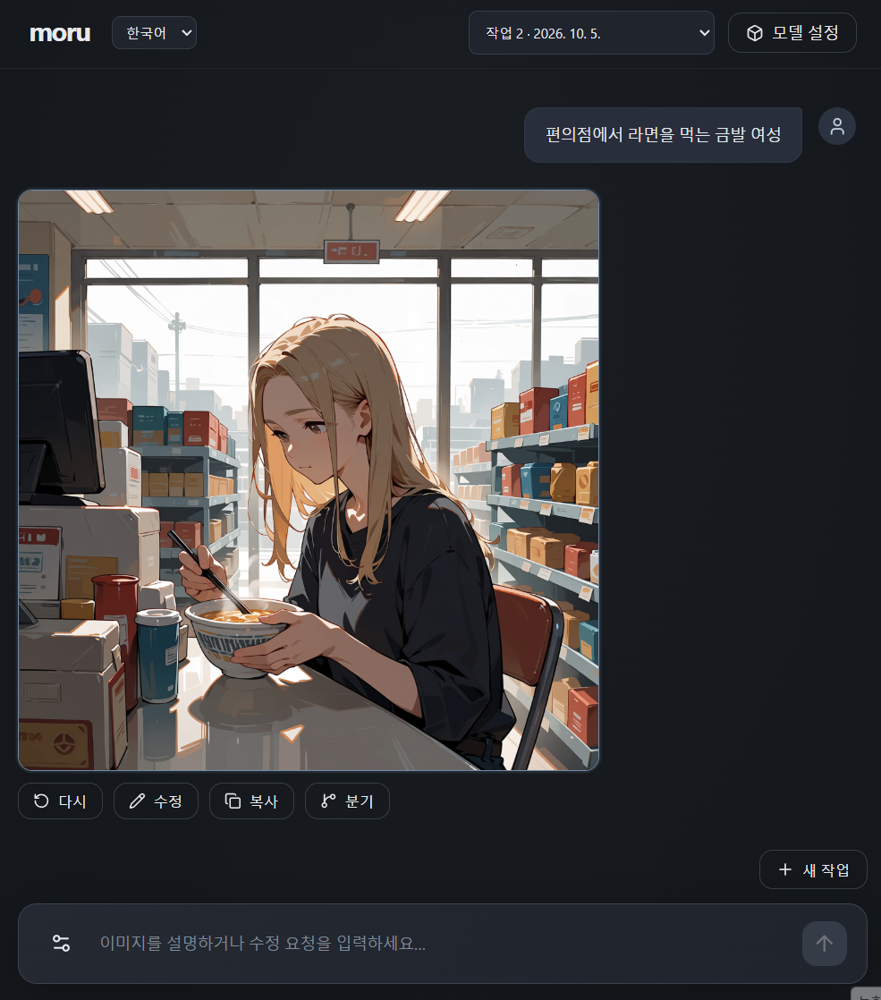

# Moru

[English](README.md)

**말로 그리고, 비교하고, 분기하세요. 이미지는 로컬에서.**

Moru는 대화로 이미지를 만드는 Windows 데스크톱 앱입니다. 원하는 장면을 설명하고,
결과를 본 뒤 무엇을 바꿀지 말하세요. 프롬프트 작성은 로컬 LLM이나 ChatGPT에 맡기고,
이미지는 내 컴퓨터에서 Anima 또는 FLUX.2로 생성합니다.

작업은 하나의 대화로 쌓입니다. 같은 요청을 다시 시도하고, 마음에 드는 버전을 고르고,
과거 이미지로 돌아가 다른 방향으로 이어갈 수 있습니다.



## 이미지가 답이 되는 대화

처음에는 원하는 장면을 평소 쓰는 말로 설명하세요.

> 금발 여성이 편의점에서 라면을 먹는 장면.

결과를 보면서 다음 요청을 이어갑니다.

> 비가 내리는 저녁으로 바꿔줘.
>
> 표정은 무표정하게 해줘.

Moru는 현재 이미지의 실제 프롬프트와 최근 요청을 참고해 다음 프롬프트를 작성하고
새 이미지를 생성합니다. 간단한 아이디어도 지정한 내용을 지키면서 어울리는 조명,
분위기, 질감을 보강합니다. 프롬프트가 작성되는 모습과 이미지 생성 진행률은
대화 안에서 확인할 수 있습니다.

## 여러 결과를 비교하고, 다른 방향으로 분기하기

**다시**는 같은 프롬프트와 현재 생성 설정으로 새 이미지 버전을 생성합니다.
결과는 같은 대화 행의 이미지 버전으로 묶입니다. 버전을 넘겨 보며 원하는 결과를
선택하고, 그 버전을 기준으로 다음 대화를 이어가세요.

**분기**는 선택한 이미지까지의 대화를 복사해 별도 작업을 시작합니다.
한쪽에서는 수채화로, 다른 쪽에서는 밤 풍경으로 이어갈 수 있습니다.
원래 작업은 남아 있고, 각 분기의 이후 작업은 따로 저장됩니다.

성공한 이미지와 프롬프트, 생성 설정, 선택한 버전은 로컬에 저장됩니다.
나중에 작업을 다시 열어 이어서 만들 수 있습니다.

## 프롬프트는 자동으로, 세부 조정은 직접

- **실제 프롬프트 편집:** 이미지에 사용된 프롬프트를 확인·복사하거나 직접 고쳐
  새 버전을 생성할 수 있습니다.
- **생성 방식 선택:** Anima Turbo, Anima Aesthetic 또는 FLUX.2 klein 4B를 선택합니다.
  이미지 크기, Steps, CFG, Seed도 조절할 수 있습니다.
- **프롬프트 작성 조절:** 최근 대화를 얼마나 참고할지 정할 수 있습니다. 로컬 LLM은
  Thinking, 추론 수준, 컨텍스트·출력 한도도 조절할 수 있습니다.
- **결과 확인과 공유:** 전체 화면 뷰어에서 확대·이동하며 이미지와 버전을 탐색하고,
  이미지 자체를 클립보드에 복사할 수 있습니다.
- **한국어·영어 UI:** 작업을 유지하면서 인터페이스 언어를 바꿀 수 있습니다.

## 이미지는 로컬에서, 프롬프트 작성은 선택해서

프롬프트를 작성할 모델은 사용 방식에 맞게 고르세요. 로컬 LLM은 내 컴퓨터에서 프롬프트를
작성하며, 모델을 준비한 뒤에는 오프라인으로 사용할 수 있습니다. Anima에서는 로컬에서 추출한
검색어로 단보루의 후보 태그를 온라인으로 조회할 수 있습니다. 요청 전문·프롬프트·대화 이력·이미지는
내 컴퓨터에 머뭅니다. 조회할 수 없으면 내장 태그 어휘로 프롬프트 작성을 계속합니다.

ChatGPT는 계정에 로그인한 뒤 사용 가능한 GPT 모델을 선택해 사용합니다. 인터넷 연결이
필요하며, 프롬프트 작성에 로컬 모델을 실행하지 않습니다. 요청·기준 프롬프트·최근 대화
텍스트가 OpenAI에 전송되고 ChatGPT 구독 사용량과 콘텐츠 정책이 적용됩니다.

둘 중 하나를 설정하면 시작할 수 있고, 둘 다 설정하면 입력창 옆에서 전환할 수 있습니다.
어느 쪽을 선택해도 이미지 생성과 저장은 내 컴퓨터에서 이루어집니다.

작업·이미지·설정은 앱의 `data/` 폴더에, 다운로드한 모델은 `models/`에 보관합니다.
앱을 옮길 때 이 폴더도 함께 옮기면 작업 기록과 모델을 유지할 수 있습니다.
다른 컴퓨터에서 ChatGPT를 사용하려면 다시 로그인하세요.

## 시작하기

Windows, NVIDIA GPU와 드라이버, Windows WebView2 Runtime이 필요합니다.

### 포터블 7z

[포터블 배포본 다운로드 (Google Drive)](https://drive.google.com/file/d/1Y_aYECQ6VqFdV51_GoDl_Uy2-r51NWwW/view?usp=sharing)

1. `Moru.7z` 전체를 압축 해제하고 `Moru.exe`를 실행합니다.
2. **모델 준비**에서 사용할 이미지 모델의 계열과 버전을 고르고, 표시된 파일을 다운로드하거나 이미 가진 파일을 지정합니다.
3. 같은 화면에서 프롬프트 작성 방식을 고르고 준비합니다. 로컬 LLM은 모델 파일을 준비하고, ChatGPT는 로그인한 뒤 GPT 모델을 선택합니다.
4. **생성 설정**에서 사용할 프롬프트 작성 모델과 이미지 모델을 선택합니다.
5. 입력창에 원하는 장면을 적어 전송하고, 이미지가 나오면 수정 요청을 이어갑니다.

포터블 배포본에는 앱 실행에 필요한 런타임이 포함되므로 Python, Node.js, ComfyUI를
별도로 설치할 필요가 없습니다. 모델은 따로 준비하며 각 배포자의 라이선스를 따릅니다.
모델을 다운로드할 때는 인터넷 연결이 필요합니다.

### 모델 수동 다운로드

이미지 모델마다 필요한 파일이 다릅니다. Anima를 사용하려면 Turbo 또는 Aesthetic
가중치 하나와 두 버전이 공유하는 문장 이해·이미지 복원 모델을 받으세요. FLUX.2 klein 4B는
전용 이미지 가중치·문장 이해·이미지 복원 모델 세 파일을 받으면 됩니다.

앱에서 다운로드가 안 되면 해당 모델의 **모델 준비 → 직접 다운로드 하기**를 열거나
아래 파일 페이지 링크를 이용하세요. Hugging Face에서 파일을 받은 뒤, Moru의 해당 모델에서
**파일 선택**을 눌러 지정합니다. 파일 이름을 바꿀 필요 없이 원하는 폴더에 저장할 수 있습니다.
로컬 LLM을 사용할 경우 프롬프트 작성용 GGUF 파일도 같은 방법으로 준비하세요.

| 모델 | 받을 파일 |
| --- | --- |
| 프롬프트 작성 모델 | [Qwen3.5-4B-Uncensored-HauhauCS-Aggressive-Q4_K_M.gguf](https://huggingface.co/HauhauCS/Qwen3.5-4B-Uncensored-HauhauCS-Aggressive/blob/c09cdbcdb1fefad6d335809d445621b5f5ba0c6e/Qwen3.5-4B-Uncensored-HauhauCS-Aggressive-Q4_K_M.gguf) |
| Anima 문장 이해 모델 | [qwen_3_06b_base.safetensors](https://huggingface.co/circlestone-labs/Anima/blob/f973fc41ec7545364ac9776c2440285f43ff2a30/split_files/text_encoders/qwen_3_06b_base.safetensors) |
| Anima 이미지 복원 모델 | [qwen_image_vae.safetensors](https://huggingface.co/circlestone-labs/Anima/blob/f973fc41ec7545364ac9776c2440285f43ff2a30/split_files/vae/qwen_image_vae.safetensors) |
| Anima Turbo | [anima-turbo-v1.1.safetensors](https://huggingface.co/circlestone-labs/Anima/blob/f973fc41ec7545364ac9776c2440285f43ff2a30/split_files/diffusion_models/anima-turbo-v1.1.safetensors) |
| Anima Aesthetic | [anima-aesthetic-v1.1.safetensors](https://huggingface.co/circlestone-labs/Anima/blob/f973fc41ec7545364ac9776c2440285f43ff2a30/split_files/diffusion_models/anima-aesthetic-v1.1.safetensors) |
| FLUX.2 klein 4B | [flux-2-klein-4b-fp8.safetensors](https://huggingface.co/black-forest-labs/FLUX.2-klein-4b-fp8/blob/5b4408e59397a4a37ccb46afe426d8ed86379441/flux-2-klein-4b-fp8.safetensors) |
| FLUX.2 문장 이해 모델 (FP4) | [qwen_3_4b_fp4_flux2.safetensors](https://huggingface.co/Comfy-Org/vae-text-encorder-for-flux-klein-4b/blob/8556e4d870cda7c53c7942b190bfeea5be9bd411/split_files/text_encoders/qwen_3_4b_fp4_flux2.safetensors) |
| FLUX.2 이미지 복원 모델 | [flux2-vae.safetensors](https://huggingface.co/Comfy-Org/flux2-klein-4B/blob/5f526678002e43af5551dadb73ce2e8c91b43afe/split_files/vae/flux2-vae.safetensors) |

### 소스에서 실행

Git, Python 3.12, uv, Node.js 22.12 이상을 준비한 뒤 PowerShell에서 실행하세요.
처음 준비할 때는 의존성과 ComfyUI를 다운로드합니다.

```powershell
git clone https://github.com/neuwcodebox/moru.git
cd moru
uv sync --frozen --extra inference
uv run --extra inference python scripts/setup_comfyui.py
cd frontend
npm.cmd ci
npm.cmd run build
cd ..
uv run --extra inference python -m moru
```

다음부터는 저장소 폴더에서 `uv run --extra inference python -m moru`로 실행합니다.
모델 준비 방법은 같으며, 이 경우 `data/`와 `models/`도 저장소 폴더에 보관합니다.

## 개발

Python 코어와 React UI로 구성됩니다. 개발 환경 준비, 테스트와 포터블 빌드는
[TECH.md](docs/TECH.md#개발-및-검증), 제품 동작은 [SPEC.md](docs/SPEC.md)를 참고하세요.
