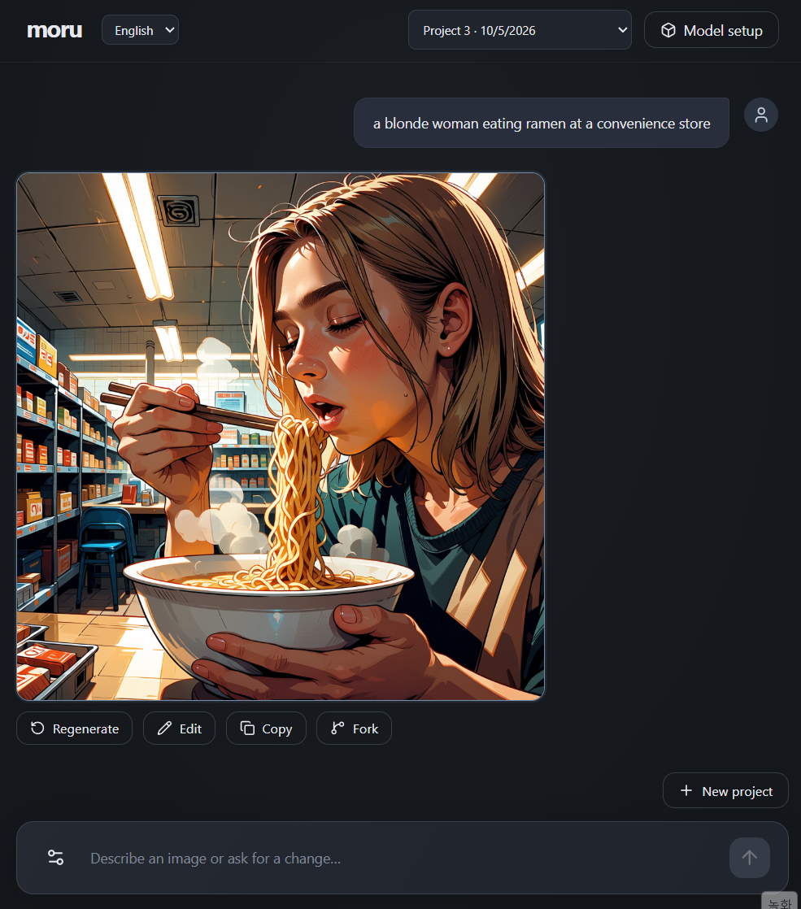

# Moru

[한국어](README.ko.md)

Moru is a Windows desktop app for creating and refining images through conversation.
A local LLM or ChatGPT turns your request into an image prompt, then Anima or FLUX.2
produces the image on your computer.



## Getting started

You need Windows, an NVIDIA GPU with its drivers, and the Windows WebView2 Runtime.

[Download portable build (Google Drive)](https://drive.google.com/file/d/1Y_aYECQ6VqFdV51_GoDl_Uy2-r51NWwW/view?usp=sharing)

Extract the entire `Moru.7z` archive and run `Moru.exe`. Python, Node.js, and ComfyUI are
included. Download model files through the app or select your own; their use is governed
by their distributors' licenses.

Projects, images, and settings are stored in `data/`; downloaded models are stored in `models/`.
Move both folders with the app. Sign in to ChatGPT again when using a different computer.

## Workflow

### 1. Prepare models

In **Model setup**, choose an image model and prepare its files.
Moru supports Anima Turbo, Anima Aesthetic, and FLUX.2 klein 4B.

Next, prepare at least one prompt writer.

- **Local LLM:** Prepare its model file to run it on your computer. Requests, prompts, and
  conversation history stay local, and prompt writing works offline.
- **ChatGPT:** Sign in with your account and choose a GPT model. It runs no local LLM and
  requires an internet connection. Requests, prompts, and recent conversation text are sent
  to OpenAI, and ChatGPT plan usage and content policies apply.

### 2. Set generation options

In **Generation settings**, choose your prepared image model and prompt writer, then adjust
image dimensions and generation options. You can enable or disable Danbooru tag search for Anima
with either a local LLM or ChatGPT. Advanced settings control how much recent conversation to use
and the reasoning options. Changes are saved when you close the settings window.

If both prompt writers are ready, switch between them directly beside the input box.

### 3. Create and refine an image

Describe a scene to have a prompt written and an image generated.
When tag search is enabled for Anima, Moru looks up matching Danbooru tags online to inform
prompt writing. After seeing the result, send a change request. Moru uses the current image's
prompt and recent conversation to create a new image.

> A blonde woman eating ramen at a convenience store.
>
> Make it a rainy evening.
>
> Give her a neutral expression.

Open the image's **Prompt** menu to inspect, copy, or edit the actual prompt and generate another result.
The **Sources** menu shows information consulted during tag searches.

### 4. Compare results and explore another direction

- **Regenerate:** Create another result with the same prompt and your current generation settings.
  Results from manual prompt edits also stay together as versions of the same conversation entry.
  Select the version you like to continue the conversation from it.
- **Fork:** Copy the conversation up to the selected image into a new project.
  Try another style or scene while keeping the original project.

Click an image to zoom, pan, compare versions, or copy it to the clipboard in the full-screen viewer.
Projects and results are saved locally so you can reopen them later and continue.

## Prepare model files manually

If an in-app download fails, use the links under **Model setup → Manual download**, then
use **Select file** to locate the file. You can keep its existing name and location.

<details>
<summary>Files for each model</summary>

Anima needs either the Turbo or Aesthetic weights and the shared text-understanding and image-decoding models.
FLUX.2 klein 4B needs its three dedicated files. Prepare the prompt-writing GGUF only when using a local LLM.

| Model | File to download |
| --- | --- |
| Local prompt model | [Qwen3.5-4B-Uncensored-HauhauCS-Aggressive-Q4_K_M.gguf](https://huggingface.co/HauhauCS/Qwen3.5-4B-Uncensored-HauhauCS-Aggressive/blob/c09cdbcdb1fefad6d335809d445621b5f5ba0c6e/Qwen3.5-4B-Uncensored-HauhauCS-Aggressive-Q4_K_M.gguf) |
| Anima text-understanding model | [qwen_3_06b_base.safetensors](https://huggingface.co/circlestone-labs/Anima/blob/f973fc41ec7545364ac9776c2440285f43ff2a30/split_files/text_encoders/qwen_3_06b_base.safetensors) |
| Anima image-decoding model | [qwen_image_vae.safetensors](https://huggingface.co/circlestone-labs/Anima/blob/f973fc41ec7545364ac9776c2440285f43ff2a30/split_files/vae/qwen_image_vae.safetensors) |
| Anima Turbo | [anima-turbo-v1.1.safetensors](https://huggingface.co/circlestone-labs/Anima/blob/f973fc41ec7545364ac9776c2440285f43ff2a30/split_files/diffusion_models/anima-turbo-v1.1.safetensors) |
| Anima Aesthetic | [anima-aesthetic-v1.1.safetensors](https://huggingface.co/circlestone-labs/Anima/blob/f973fc41ec7545364ac9776c2440285f43ff2a30/split_files/diffusion_models/anima-aesthetic-v1.1.safetensors) |
| FLUX.2 klein 4B | [flux-2-klein-4b-fp8.safetensors](https://huggingface.co/black-forest-labs/FLUX.2-klein-4b-fp8/blob/5b4408e59397a4a37ccb46afe426d8ed86379441/flux-2-klein-4b-fp8.safetensors) |
| FLUX.2 text encoder (FP4) | [qwen_3_4b_fp4_flux2.safetensors](https://huggingface.co/Comfy-Org/vae-text-encorder-for-flux-klein-4b/blob/8556e4d870cda7c53c7942b190bfeea5be9bd411/split_files/text_encoders/qwen_3_4b_fp4_flux2.safetensors) |
| FLUX.2 VAE | [flux2-vae.safetensors](https://huggingface.co/Comfy-Org/flux2-klein-4B/blob/5f526678002e43af5551dadb73ce2e8c91b43afe/split_files/vae/flux2-vae.safetensors) |

</details>

## Run from source

Install Git, Python 3.12, uv, and Node.js 22.12 or later, then run these commands in PowerShell.
Initial setup downloads dependencies and ComfyUI.

```powershell
git clone https://github.com/neuwcodebox/moru.git
cd moru
uv sync --frozen --extra inference
uv run --extra inference python scripts/setup_comfyui.py
cd frontend
npm.cmd ci
npm.cmd run build
cd ..
uv run --extra inference python -m moru
```

For subsequent launches, run `uv run --extra inference python -m moru` from the repository folder.
The same setup and workflow apply, with `data/` and `models/` stored in that folder.

## Development

See [TECH.md](docs/TECH.md#개발-및-검증) for development setup, tests, and portable builds,
and [SPEC.md](docs/SPEC.md) for detailed product behavior.
